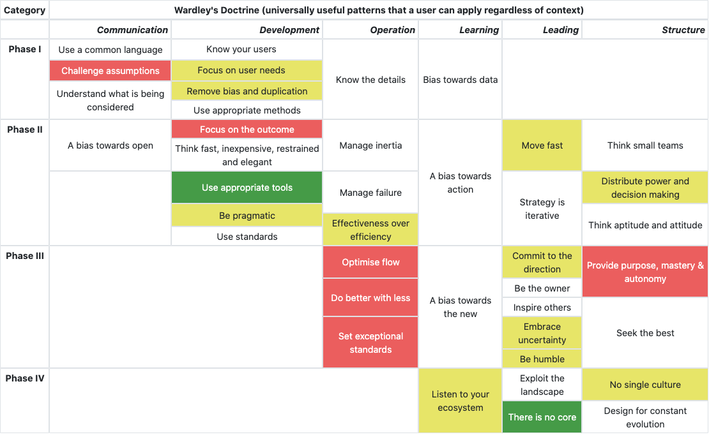
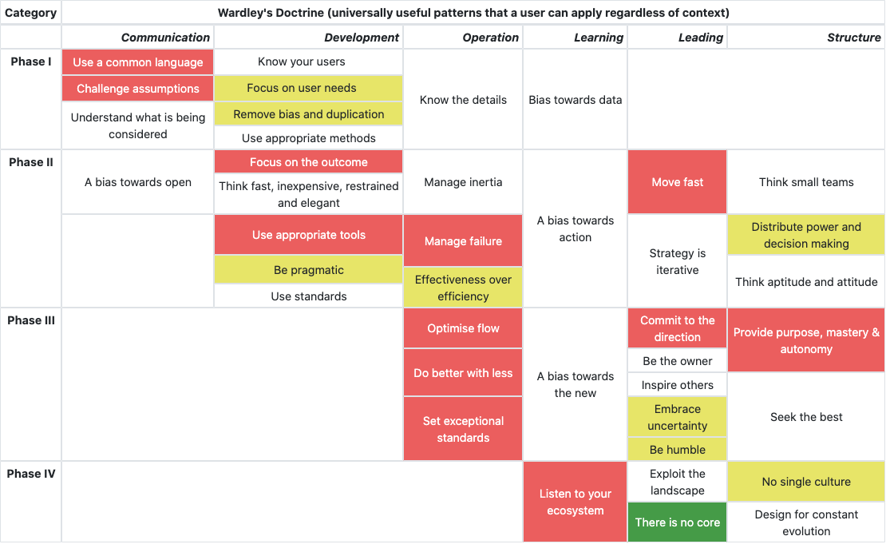
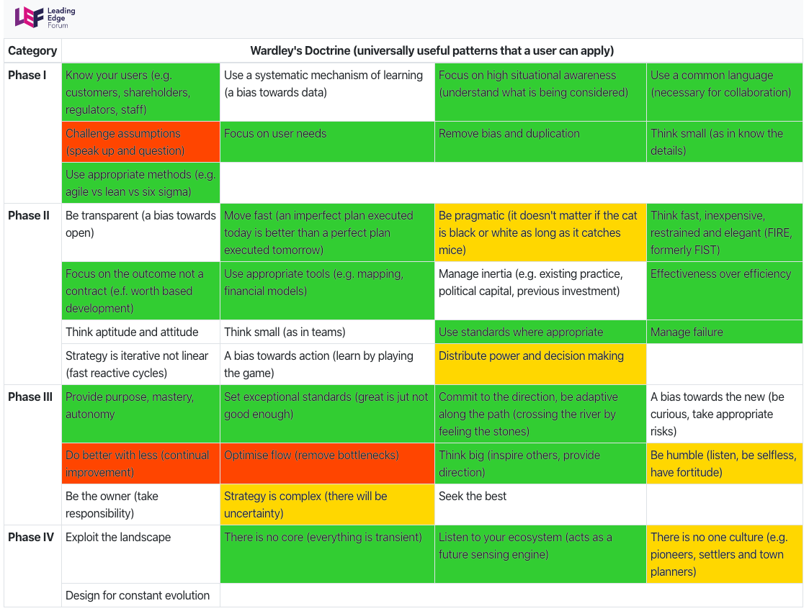

# Doctrine

A very simple tool for visualising how competitive is the company in the light of Simon Wardley's Doctrine.

You can navigate using ```Tab``` and use keys ```1```,```2``` & ```3``` to change your evaluation.

---

 If you are like this:
 
 
 
 
 And your competition is like this:
 
 
 
 you have nothing to worry about. But if your competitor is like this:
 
 
 
 they will run circles around you.
 
 Learn more at https://learn.wardleymaps.com!